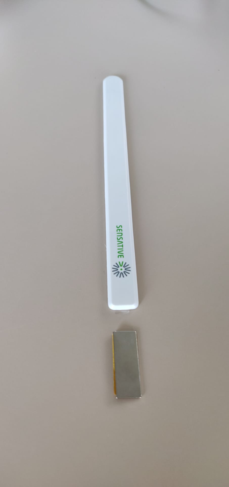

## Window Sensor documentation

Monitoring of windows in the boat house. Sensors send an event with the window is open or closed. This event is sent over ZWave to the fog device and from there to SIOT over mqtt.

**Fog Device**


**Sensor**


### SIOT Connection string and json definition for APP Team
```
https://siot.net:19025

mqtt://siot.net 1883

siot/DAT/60CE-EF63-AE15-78F7-6F84-45B9-FD75-037F/9a24aae2-0dda-2feb-1414-cf9dbbc2e404

{
	"windowId": "windowID"
	"Open": "true/false"
}
```


### Open ZWave Shared Nodejs script to connect
[Open ZWave Shared](https://github.com/OpenZWave/node-openzwave-shared/blob/master/README-raspbian.md)

```
node12: changed: 113:Alarm Type:0->0
node12: changed: 113:Alarm Level:0->0
node12: changed: 113:SourceNodeId:0->0
node12: changed: 113:Access Control:23->22
```

### ZWave2MQTT Bridge
Simple Brigde with Web based interface to configure the zwave and mqtt connection.


https://github.com/OpenZWave/Zwave2Mqtt

```
git clone https://github.com/OpenZWave/Zwave2Mqtt
cd Zwave2Mqtt
npm install
npm run build
npm start
```

### Reconnect after restart of node (Wake up strip)
* How to manually wake up Strips Guard
* Move magnet over the user command sensor 3 times ( 3 LED blinks)
* 5 short blinks indicates failure. Try again or contact customer support 

### Meaning of values
22 = open
23 = closed

### Todo Node Red
Node Red flow zwave to mqtt.

22 = true
23 = closed

And set window ID


### Strips magnet sequences
**Quickstart**

1. Start the add mode on the Z-Wave controller. See the controller’s manual. 
2. Remove both magnets from Strips. Strips blinks twice to confirm the command and successful addition. 
3. A long LED blink indicates that the add process was successful 
4. The Z-Wave controller application should now allow you to monitor your Strips sensor status. 
5. Move the squared magnet as shown in the picture . Check that the Z-Wave system indicates the status correctly

**Add Manual**

1. Set the controller to add mode (See your controller’s manual).
2. Place the round magnet at the rounded edge of Strips. When the LED blinks, move the magnet away. Repeat 3 times in total within 10 seconds.
3. A long LED blink indicates that the add process was successful.

**Reset**
Set the Node into the exclusion mode

1. Touch the supplied magnet against the rounded and wait for the LED to blink
2. Move the magnet towards the center two (2) times On the last pass, leave the magnet on rounded edge for ten (10) seconds